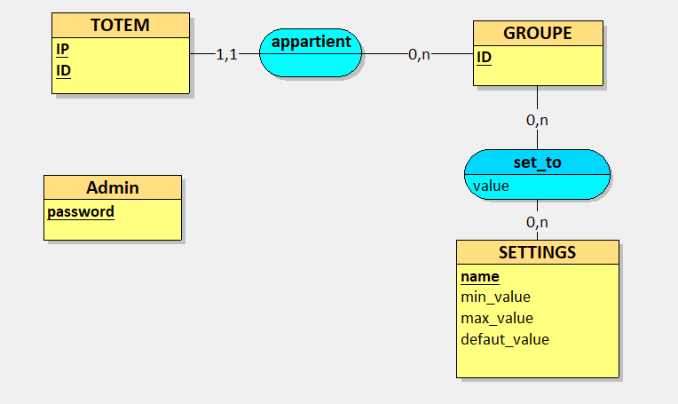

# TOTEM DATABASE

## Introduction

This project is a database for the totem project.

## Requirements

- [PostgreSQL](https://www.postgresql.org/) 9.6 or higher

## SetUP

to create the database, you need to execute the query in the file

> `create.sql` in the root of the project.

then add the postgreSQL Functions that can be found in the file

> `preparedFunction.sql` in the root of the project.

then add the default data that can be found in the file

> `defaultData.sql` in the root of the project.

## Reset

to reset the database, you need to execute the query in the file `reset.sql` in the root of the project.

## Model

